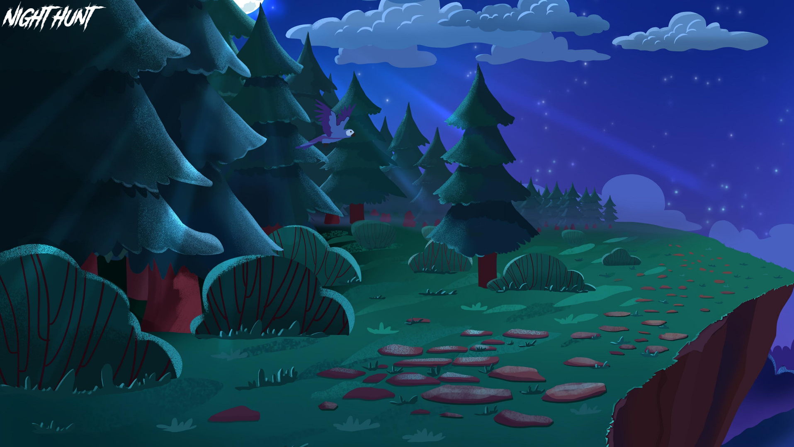

# My Hunter 🐦

Welcome to **My Hunter**.

This game revives the classic Duck Hunt experience with a modern twist.

It's not only a nostalgic trip but also a fantastic opportunity to delve into game development using C.

## Language and Tools 🛠️

- **Language:** C
- **Framework:** SFML (Simple and Fast Multimedia Library)
- **Compilation:** Via Makefile, including `re`, `clean`, and `fclean` rules.
- **Binary Name:** my_hunter

## Project Overview 🔎

In **My Hunter**, you step into the shoes of a hunter, tasked with shooting ducks as they appear and traverse across the screen. This project is your first foray into video game creation, offering a blend of user input management and animated sprite display. We encourage creativity in theming while adhering to the fundamental rules of the game.

## Game Features 🎮

- **Core Mechanics:** Play as a hunter shooting ducks moving across the screen.
- **Input Management:** Utilize mouse clicks to shoot at the ducks.
- **Visual Elements:** Animated sprites to bring the ducks and hunter to life.

## Gameplay 🕹️

Engage in a simple yet captivating gameplay where ducks appear randomly on the screen, and you have to click to shoot them down. Aim for accuracy and speed to rack up your score!

## Preview 📸

*Here's a sneak peek at My Hunter's gameplay. Get ready to test your shooting skills!*

## Installation and Usage 💾

1. Clone the repository.
2. Compile the game using `make`.
3. Run the game: `./my_hunter`.
4. For detailed guidelines, refer to `my_hunter.pdf`.

## License ⚖️

This project is released under the MIT License. See `LICENSE` for more details.
